# Songstress

> A self-hosted music suite: an Apple-Music-grade player for **web, desktop, and mobile (iOS & Android)** on top of your Navidrome library — with automated in-place FLAC upgrades, cross-library deduplication, playlist import, and cross-device playback.

[](https://github.com/pacholoamit/songstress-releases/issues)
[](https://github.com/pacholoamit/songstress-releases/releases/latest)
[](#clients)
[](LICENSE)

> [!WARNING]
> **Songstress is in ALPHA.** Expect rough edges, breaking changes between
> releases, and bugs. Please don't point it at irreplaceable data without
> backups. Hit something broken or have an idea? **[Open an issue](https://github.com/pacholoamit/songstress-releases/issues)** — feedback is very welcome and genuinely shapes what gets fixed next.

This repo hosts **releases, desktop installers, and the auto-update feed**. The source code lives in a private repository.

<p align="center">
  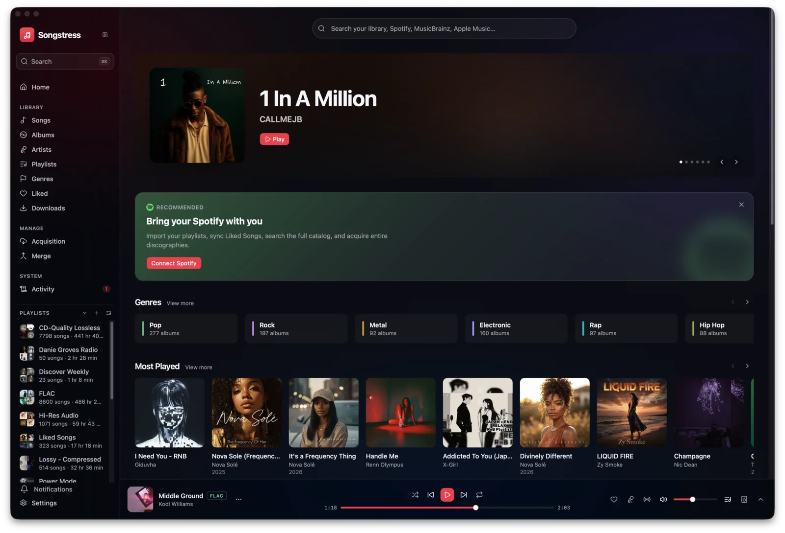
</p>

Songstress started as an answer to one itch — the MP3s and AACs that should have
been FLAC all along. **Acquisition** scans your library for lossy files, hunts
down verified-lossless replacements (12 lossless stores → Soulseek →
YouTube Music), and swaps them in place — and the same pipeline downloads whole artists,
albums, and playlists on demand — while your Navidrome favorites and playlists
stay intact.

It has since grown into the whole listening stack: a liquid-glass player that
follows you from the desktop to the couch to the phone, playlists imported from
Spotify and ListenBrainz, duplicate-free multi-library management, and Home
Screen widgets.

## Clients

One shared core, three first-class clients — a browser dashboard served straight
from the server, a desktop app, and a mobile app for iOS and Android.

| | Client | Highlights |
|---|---|---|
| 🌐 | **Web** | The full dashboard at `:8090`. Gapless dual-buffer playback, artwork-tinted pages, global search across your library, Spotify, MusicBrainz, and Apple Music. |
| 🖥️ | **Desktop** (macOS · Linux · Windows) | Tauri shell with a tray mini-player, native media keys + now-playing widget, offline downloads, close-to-tray, **auto-updates served from this repo**. |
| 📱 | **Mobile** (iOS · Android) | One Expo/React Native app: native tabs, a full-screen player with drag-to-dismiss, offline downloads, lock-screen / media-notification controls. **iOS adds Home Screen widgets and liquid-glass UI.** |

<details>
<summary><b>📱 The mobile app in pictures</b></summary>
<br/>

**Home** — shelves for Most Played, Newly Added, Recently Played

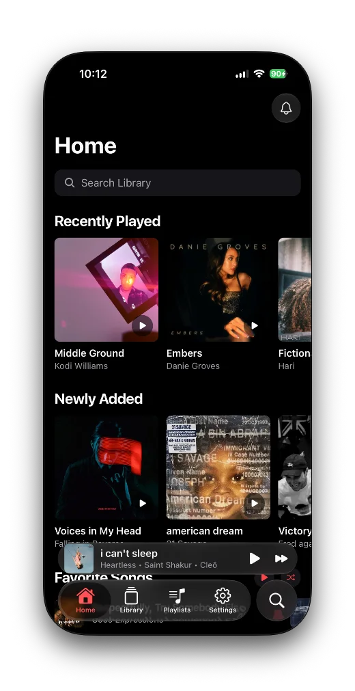

**Library** — songs, albums, artists, genres, liked

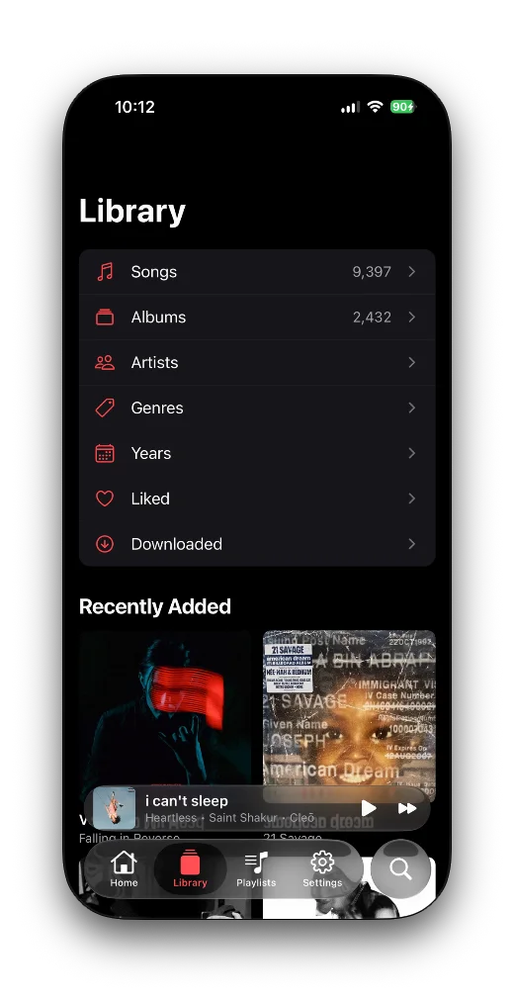

**Full-screen player** — liquid glass, drag-to-dismiss

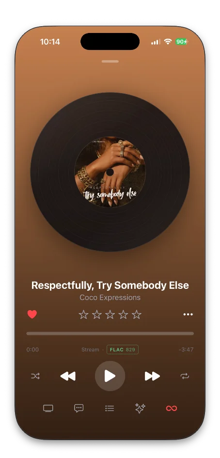

</details>

### Cross-device playback (Songstress Connect)

Every client registers as a device. Start music on the desktop, open the phone,
and the phone **auto-follows** the active session — remote transport controls,
live queue sync, and a one-tap handoff of playback between devices,
Spotify-Connect style.

<details>
<summary><b>📸 Remote-controlling another device from the phone</b></summary>
<br/>

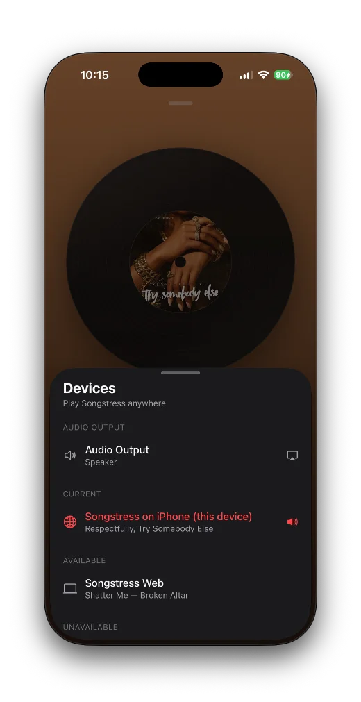

</details>

## Features

### Player & library

- Gapless playback with buffering-aware scrubbing on every platform, plus a
  **smart queue** — shuffle (current track pinned), repeat off / all / one,
  play-next & enqueue, drag-to-reorder, and a persisted queue that resumes right
  where you left off
- A **full-screen player** with Up Next / Lyrics / Related tabs, format badges
  (FLAC 16/44.1, MP3 320…), a Last.fm global play-count pill, and an optional
  **spinning vinyl** now-playing mode
- **Synced lyrics** — time-synced, tap any line to seek; plus an optional
  rolling lyric strip above the player bar
- Artwork-derived background washes on album/artist/playlist pages
- **Auto DJ & radio** — Track Radio and artist radio via Navidrome instant mix;
  Auto DJ keeps similar tracks flowing when the queue runs dry
- Browse **by genre and by year**, plus a Home full of shelves — Most Played,
  Newly Added, Recently Played, Recently Released, Explore From Your Library
- **Unified search** across your library, Spotify, MusicBrainz, and Apple Music
- A 10-band **equalizer with AutoEq headphone corrections** (search your exact
  headphones, one tap to apply)
- **Per-device player customization** and per-network stream quality (original,
  or Navidrome-transcoded MP3/Opus at a capped bitrate)
- Offline downloads on desktop and mobile

<details>
<summary><b>📸 The player, lyrics, library, and radio</b></summary>
<br/>

**Full-screen player** — artwork-tinted, Up Next / Lyrics / Related tabs

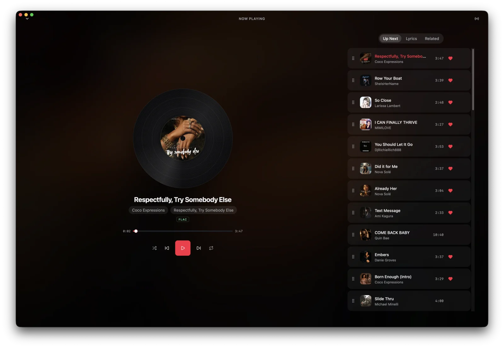

**Synced lyrics** — tap any line to seek

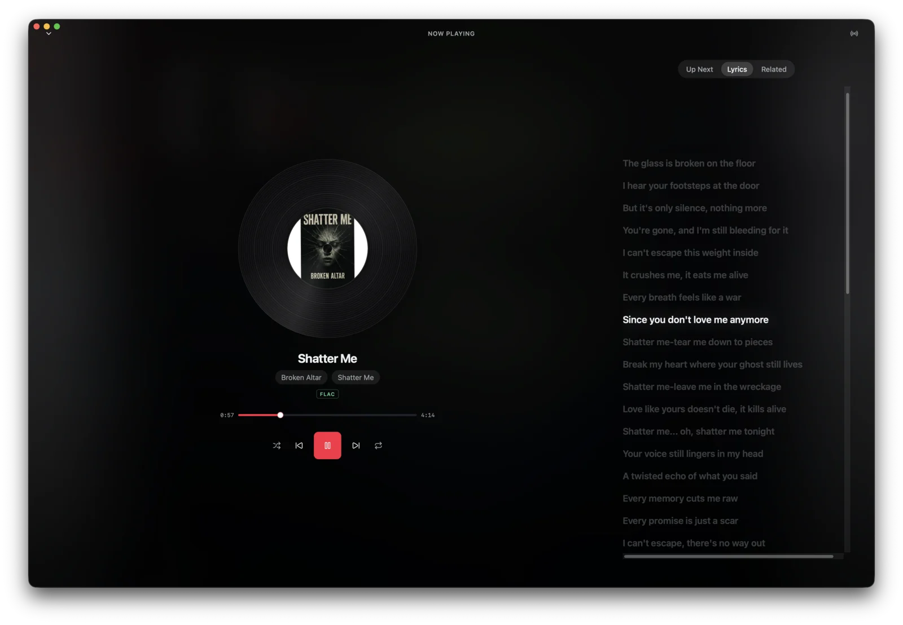

**Songs** — the library with format badges and play counts

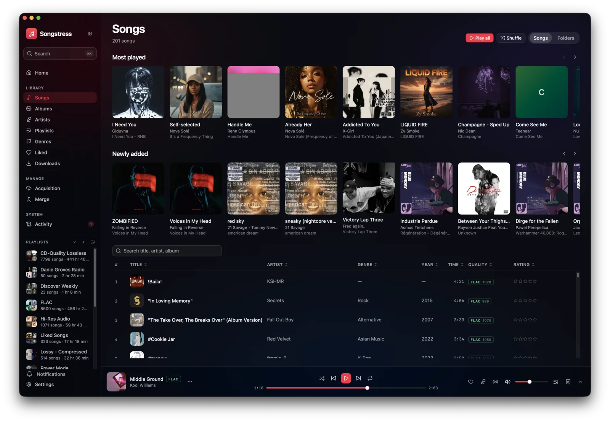

**Track radio on mobile** — instant mix seeded from any song

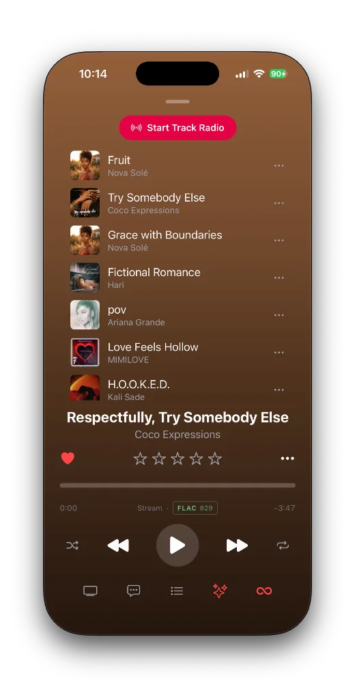

</details>

### Manage › Acquisition — the original heart of the project

- In-place lossy → FLAC upgrades with a strict duration-match guard
- Download whole artists, albums, and playlists on demand ("Add to Library"),
  filed into your library through the same verified-lossless pipeline
- A live dashboard: what passed / failed / is queued per service, scheduled
  sweep progress, worker concurrency, VPN rotation
- **12 lossless stores** — Tidal/Qobuz (Hi-Res), Deezer/Amazon/NetEase/
  JOOX/Migu/Kuwo (FLAC), Apple (ALAC), plus SoundCloud/YouTube/Pandora (lossy) —
  each toggled, drag-to-reorder
- **Quality ladder** (Atmos → Hi-Res Lossless → Hi-Res → Lossless → High → Low) and
  format gating (FLAC / ALAC / AAC / MP3); upgrades always stay lossless
- **Synced-lyrics embedding** (Spotify / Apple / Musixmatch / LRCLIB / Amazon) and
  **metadata enrichment** (Deezer / Apple / Qobuz / Tidal / SoundCloud)
- Folder + filename templates with download placeholders — preset or custom
- Two-tier retry back-off; one flat priority ladder (lossless stores / Soulseek /
  YouTube Music, YouTube limited to below-bitrate upgrades only); Navidrome rescan after
  swaps with favorites/playlist preservation

<details>
<summary><b>📸 The Acquisition dashboard and the upgrade feed</b></summary>
<br/>

**Acquisition dashboard** — lossless coverage, live jobs, per-service stats

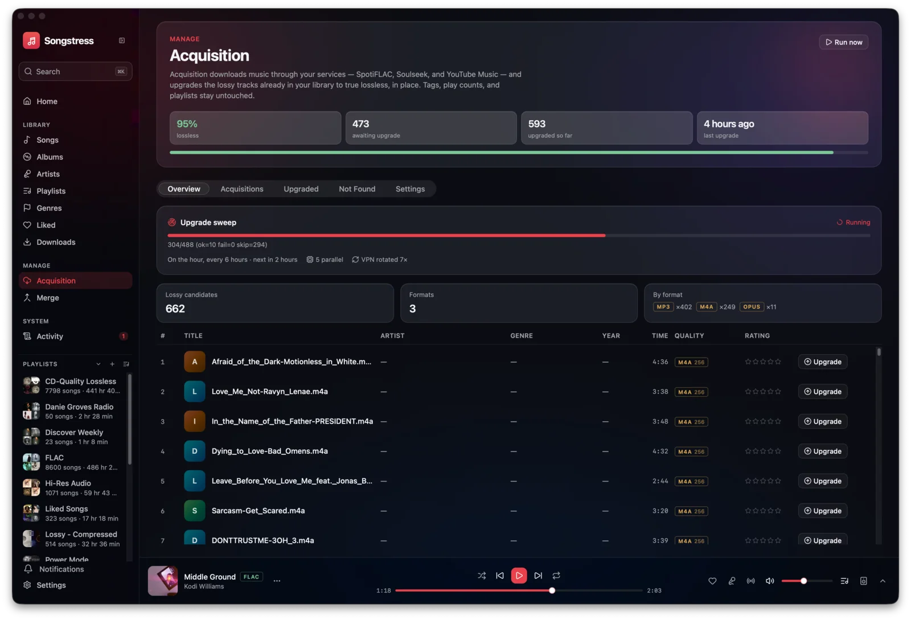

**Upgrade feed** — every lossy → FLAC swap, before → after

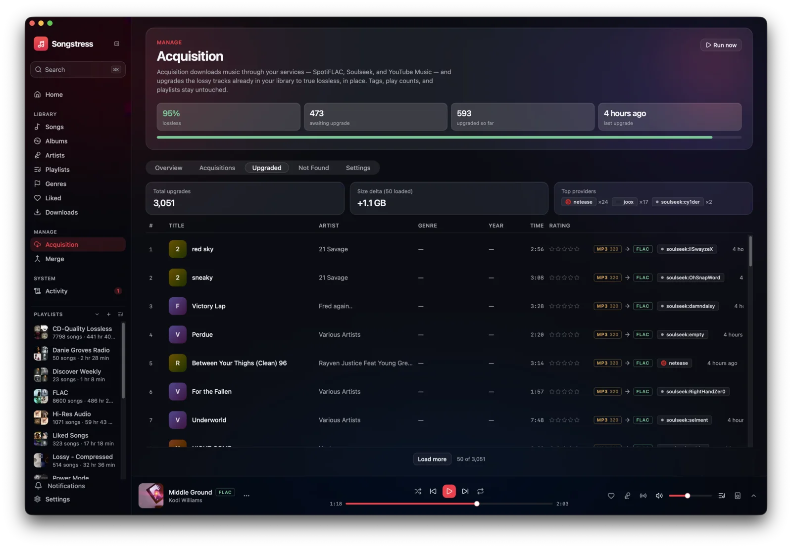

</details>

### Manage › Merge — duplicate-free multi-library

- Finds the same recording across libraries (MusicBrainz ID / ISRC exact
  matches, conservative metadata+duration matching below that)
- Keeps the highest-quality copy and replaces the rest with relative symlinks;
  quarantine + one-click **Undo** for every merge

<details>
<summary><b>📸 Merge review</b></summary>
<br/>

**Merge** — duplicate groups, confidence tiers, reclaimable space

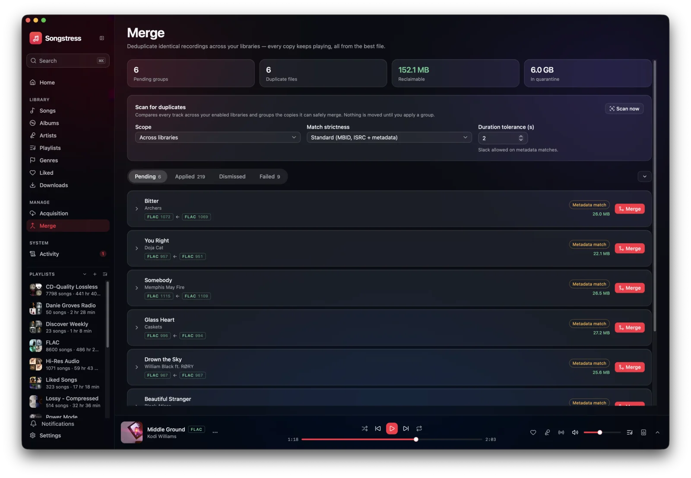

</details>

### Import & discovery

- Spotify, Apple Music, and Tidal playlist import (Tidal covers albums and
  discographies), Liked Songs sync, discography downloads, full-catalog search
- ListenBrainz "Made For You" weekly playlists; Last.fm & ListenBrainz scrobbling
- **Playlist time machine** — version history on a horizontal timeline; diff any
  two states, play or restore an old version
- **Drag-to-reorder playlists** on every client, written back to Navidrome

<details>
<summary><b>📸 Importing and living with playlists</b></summary>
<br/>

**Playlist import** — paste a Spotify / Apple Music / Tidal / ListenBrainz URL,
missing tracks are acquired losslessly and filed into your library

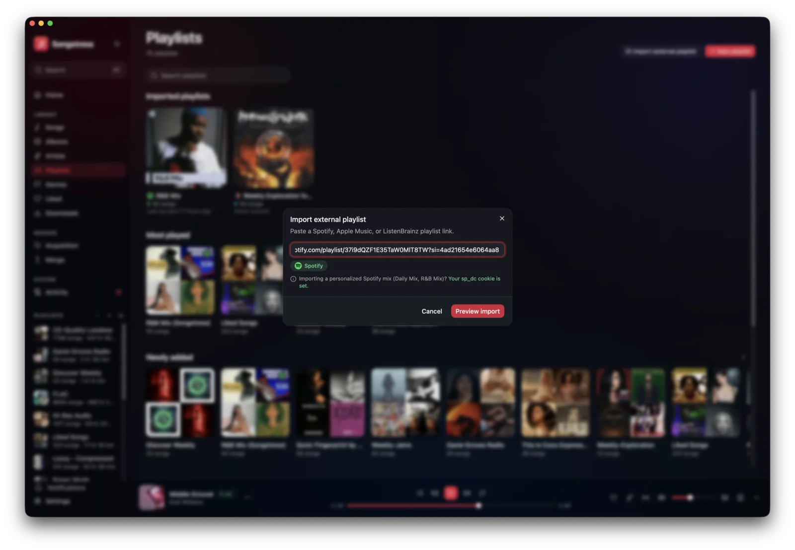

**Playlists** on desktop

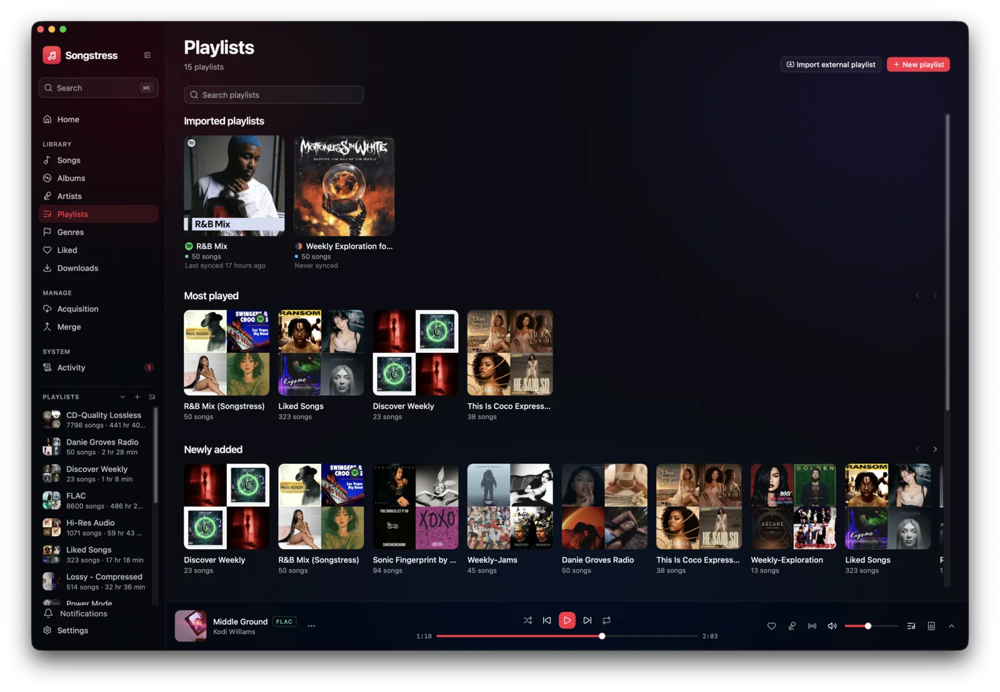

**A playlist page** — artwork-tinted, with the version-history time machine

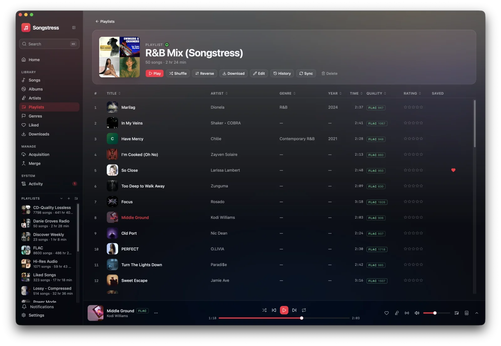

**Playlists on mobile** — browsing and inside a playlist

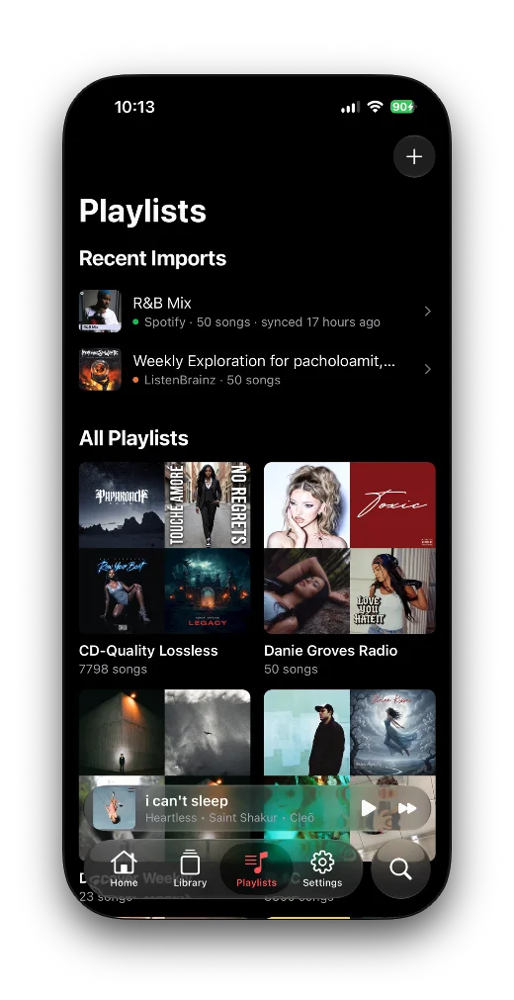

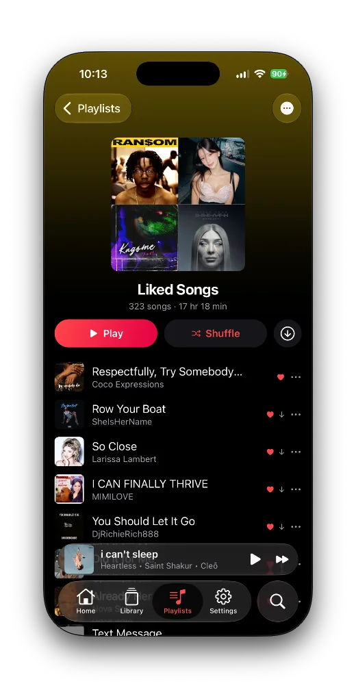

</details>

## Start Songstress

```sh
curl -fsSL https://raw.githubusercontent.com/pacholoamit/songstress-releases/main/install.sh | sh
```

That's it. An interactive wizard preflights your host, asks what you want
(Discovery sonic analysis, VPN egress), generates pinned compose files with
locked-down secrets, brings the stack up, and health-checks it. Scriptable too:
`songstress install --yes --music-dir /srv/music --components discovery`.

> **Preview:** the generated deployment targets the upcoming `v0.21` server
> images. Until that release ships, use the manual Quickstart below.

**Nothing here asks you to trust an opaque binary.** The CLI's full source
lives in [`cli/`](cli/) in this repository, releases are built by [a public
workflow](.github/workflows/cli.yml) with `CGO_ENABLED=0 -trimpath` (build it
yourself and compare), every download is sha256-verified by
[`install.sh`](install.sh), and the generated compose files are plain YAML you
can read before ever running `docker compose up`.

### Networking is up to you

The installer publishes the dashboard on its port (`8090` by default) and stops
there — it terminates no TLS, claims no domain, and joins no tailnet. How that
port is reached is yours to decide:

- **On your LAN** — nothing to do. Open `http://<host>:8090`.
- **From anywhere** — front it with whatever you already run: a reverse proxy
  (Caddy, nginx, Traefik), a Cloudflare Tunnel, Tailscale, a WireGuard VPN.

Bringing your own means you keep your certificates, your auth layer, and your
DNS — and Songstress never fights them for port 443. See
[Security](#security) before you expose it: the app ships with no built-in
authentication.

If you serve it on a public domain, set `SONGSTRESS_PUBLIC_URL` in the
generated `.env` so invite and password-reset links in emails point at your
domain instead of `http://localhost:8090`:

```sh
SONGSTRESS_PUBLIC_URL=https://music.example.com
```

> Egress VPN is a different thing and still built in: `--components vpn` routes
> **acquisition traffic out** through [gluetun](#vpn-egress-gluetun). That's
> download privacy, not inbound access.

## Quickstart

Two containers, zero Navidrome configuration: the Songstress image (datastore,
web dashboard, acquisition worker) plus the official Navidrome alongside it.
Songstress provisions Navidrome, logs in, and triggers scans — you never
configure or even see it.

```sh
mkdir songstress && cd songstress
```

Create a `.env`:

```sh
# required
MUSIC_DIR=/path/to/your/music
NAVIDROME_PASSWORD=any-strong-value   # shared: creates ND's admin, Songstress logs in with it
# On another machine? Point this at a host/IP your browser can reach:
# NAVIDROME_PUBLIC_URL=http://your-server:4533

# recommended
TZ=UTC

# accounts — invite-only (see "Accounts & invites"). Set this pair to pick your
# operator sign-in; leave empty to create the admin in-app on first connect.
SONGSTRESS_ADMIN_EMAIL=
SONGSTRESS_ADMIN_PASSWORD=

# email/SMTP — outbound invitations, password resets & notifications (optional)
SMTP_HOST=
SMTP_PORT=587
SMTP_USERNAME=
SMTP_PASSWORD=
SMTP_FROM=
SMTP_TO=
SMTP_STARTTLS=true

# optional integrations (editable later in the dashboard)
SPOTIFY_CLIENT_ID=
SPOTIFY_CLIENT_SECRET=
SPOTIFY_REDIRECT_URI=
LASTFM_API_KEY=
LISTENBRAINZ_TOKEN=
LIDARR_URL=
LIDARR_API_KEY=
```

Create a `compose.yaml`:

```yaml
services:
  songstress:
    image: ghcr.io/pacholoamit/songstress:latest
    container_name: songstress
    env_file: .env
    environment:
      - PUID=1000
      - PGID=1000
      # Songstress provisions + drives the Navidrome service below; the player
      # streams straight from it on port 4533.
      - NAVIDROME_URL=http://navidrome:4533
      - NAVIDROME_USERNAME=admin
      - NAVIDROME_PASSWORD=${NAVIDROME_PASSWORD}
      - NAVIDROME_PUBLIC_URL=http://localhost:4533   # browser-reachable; use your host/IP
    ports:
      - "8090:8090"
    volumes:
      - ./data:/pb/pb_data
      - ${MUSIC_DIR}:/music
    tmpfs:
      - /tmp:mode=1777
    depends_on:
      navidrome:
        condition: service_healthy
    restart: unless-stopped

  navidrome:
    image: deluan/navidrome:0.62.0
    container_name: songstress-navidrome
    user: "1000:1000"
    environment:
      - ND_MUSICFOLDER=/music
      - ND_DATAFOLDER=/data
      - ND_PORT=4533
      - ND_SCANNER_SCHEDULE=0        # Songstress triggers scans — no double-scanning
      - ND_SCANNER_WATCHERWAIT=0
      - ND_SCANNER_SCANONSTARTUP=true
      - ND_ENABLETRANSCODINGCONFIG=true
      - ND_DEVAUTOCREATEADMINPASSWORD=${NAVIDROME_PASSWORD}   # creates 'admin' on FIRST boot only
    ports:
      - "4533:4533"        # the browser streams/seeks directly from Navidrome
    volumes:
      - ./data/navidrome:/data   # nested next to the datastore — one backup root
      - ${MUSIC_DIR}:/music:ro
    healthcheck:
      test: ["CMD", "wget", "-qO-", "http://127.0.0.1:4533/ping"]
      interval: 30s
      timeout: 5s
      retries: 5
    restart: unless-stopped
```

```sh
docker compose up -d
```

Open the dashboard at `http://localhost:8090` (admin UI at
`http://localhost:8090/_/`). Integration settings are seeded from the
environment on first boot, then become editable in the dashboard.

### Accounts & invites

Songstress is **invite-only** — there is no public sign-up. The
`SONGSTRESS_ADMIN_EMAIL` / `SONGSTRESS_ADMIN_PASSWORD` pair is your **operator
account**: the sign-in you use on the web app, desktop, and mobile (and the
`/_/` admin console). Everyone else joins by invitation from **Manage › Users**.

- **Set the pair** — the `songstress install` wizard does this for you, or put it
  in `.env` — and it becomes your admin sign-in on first boot.
- **Leave it empty** and the server generates internal credentials (saved to
  `./data/.admin-credentials`); the first client to connect then gets a
  **create-admin** screen, so you finish setup right in the app.

Configure **SMTP** to let Songstress send outbound email — user invitations,
password resets, and notification emails. Set `SMTP_HOST`, `SMTP_PORT` (default
`587`), `SMTP_USERNAME`, `SMTP_PASSWORD`, `SMTP_FROM`, `SMTP_TO` (notification
recipient), and `SMTP_STARTTLS` (default `true`) — configure them via the
`songstress install` wizard's optional SMTP group, or edit `.env` directly.
Without SMTP you can still add users; you just hand them their password
out-of-band.

> **Upgrading:** pull the new images and recreate — the datastore, its
> migrations, and the worker ship together, so schema and worker stay in
> lockstep. Navidrome upgrades independently (pin its tag as you like).

> **Coming from the all-in-one image?** The `:all-in-one` tags are retired and
> will not receive new releases. Your data already has the right shape
> (`data/navidrome` next to the datastore): switch to the compose above, set
> `NAVIDROME_PASSWORD` in `.env` to your existing Navidrome admin password
> (saved in `data/.navidrome-credentials`), and `docker compose up -d`.

## Already have a Navidrome/Subsonic server?

Use the standard image and point Songstress at your server. Set `MUSIC_DIR` and
the `NAVIDROME_*` values in `.env`, then:

```yaml
services:
  songstress:
    image: ghcr.io/pacholoamit/songstress:latest   # or vX.Y.Z, or edge
    container_name: songstress
    env_file: .env
    environment:
      - PUID=1000
      - PGID=1000
    ports:
      - "8090:8090"
    volumes:
      - ./data:/pb/pb_data
      - ${MUSIC_DIR}:/music
    tmpfs:
      - /tmp:mode=1777
    restart: unless-stopped
```

`.env`:

```sh
NAVIDROME_URL=http://your-navidrome:4533
NAVIDROME_USERNAME=you
NAVIDROME_PASSWORD=secret
NAVIDROME_PUBLIC_URL=http://your-navidrome-host:4533   # browser-reachable
```

So Navidrome indexes what Songstress acquires, make the acquisition library
visible to it — mount `MUSIC_DIR` inside your existing Navidrome music root, or
(Navidrome ≥ 0.58) add it as a second library. Songstress triggers a rescan
after every acquisition.

**Multiple libraries:** add a bind mount per library and list them in
`MUSIC_LIBRARIES`:

```yaml
    volumes:
      - /srv/music:/music
      - /srv/flows:/flows
    environment:
      - MUSIC_LIBRARIES=Main=/music;Flows=/flows
```

## Docker image channels

Every image ships the datastore, its PocketBase migrations, the web dashboard,
and the acquisition worker **together** — schema and worker are built in
lockstep, so whichever tag you pick, pull-and-recreate is always safe (no version
skew). Images live on `ghcr.io/pacholoamit/songstress`; the music server is the
official `deluan/navidrome` image running alongside (pin its tag independently).

| Tag | Use it for |
|-----|-----------|
| `:latest` | The newest stable release. Most people want this. |
| `:vX.Y.Z` / `:vX.Y` | Pin an exact release, or the latest patch of a minor line. |
| `:edge` | Rolling — rebuilt on every push to `main`. Newest fixes, less baked. |
| `:main-<sha>` | An exact commit build, for pinning or bisecting. |

`:latest` and `:vX.Y.Z` move only when a release is published; `:edge` moves on
every merge to `main`. All tags are multi-arch (`linux/amd64` +
`linux/arm64`). Songstress is in alpha — pin a `:vX.Y.Z` tag if you want to
control exactly when you upgrade.

> The former `-all-in-one` image family (bundled Navidrome) is retired; those
> tags remain pullable but frozen. Use the Quickstart topology above instead.

## VPN egress (Gluetun)

The lossless-store gateways rate-limit per exit IP (they throttle an IP after
roughly 40 downloads), and Soulseek P2P is generally happier behind a VPN. Run
Songstress **inside [gluetun](https://github.com/qdm12/gluetun)'s network
namespace** so every provider request — store HTTP downloads *and* Soulseek
transfers — leaves through the tunnel. gluetun's firewall still publishes the
dashboard on your LAN and lets Songstress reach Navidrome + local clients
directly.

Add a `gluetun` service and join **only Songstress** to its network namespace —
Navidrome stays outside the tunnel and keeps publishing its own port. Additions
relative to the Quickstart `compose.yaml`:

```yaml
services:
  gluetun:
    image: qmcgaw/gluetun:v3
    container_name: songstress-gluetun
    cap_add:
      - NET_ADMIN
    devices:
      - /dev/net/tun:/dev/net/tun
    ports:
      - "8090:8090"          # dashboard — published here because Songstress shares this netns
    volumes:
      - ./gluetun:/gluetun   # holds auth/config.toml (see Exit-IP rotation)
    environment:
      - VPN_SERVICE_PROVIDER=${VPN_SERVICE_PROVIDER:-protonvpn}
      - VPN_TYPE=wireguard
      - WIREGUARD_PRIVATE_KEY=${WIREGUARD_PRIVATE_KEY}
      - WIREGUARD_ADDRESSES=${WIREGUARD_ADDRESSES:-10.2.0.2/32}
      - FIREWALL_INPUT_PORTS=8090                               # keep the UI reachable on the LAN
      - FIREWALL_OUTBOUND_SUBNETS=${LAN_SUBNET:-172.16.0.0/12}  # LAN/Docker traffic bypasses the tunnel
      - DNS_KEEP_NAMESERVER=on                                  # keep Docker DNS so `navidrome` resolves
      - TZ=${TZ:-UTC}
    restart: unless-stopped

  songstress:
    # …everything from the Quickstart service, minus `ports:`, plus:
    network_mode: "service:gluetun"   # share gluetun's netns — all egress via the tunnel
    depends_on:
      gluetun:
        condition: service_started
      navidrome:
        condition: service_healthy

  # navidrome: unchanged from the Quickstart — it publishes 4533 itself and
  # stays off the VPN, so browser streaming is unaffected by tunnel hiccups.
```

```sh
docker compose up -d
```

The overlay defaults to **ProtonVPN over WireGuard**. Add these to your `.env`:

```sh
VPN_SERVICE_PROVIDER=protonvpn
WIREGUARD_PRIVATE_KEY=wOEI9c…=      # from your provider's WireGuard config
WIREGUARD_ADDRESSES=10.2.0.2/32     # the tunnel address your provider assigns
LAN_SUBNET=172.16.0.0/12           # add your LAN, e.g. 172.16.0.0/12,192.168.1.0/24
```

| Variable | Example | Notes |
|---|---|---|
| `VPN_SERVICE_PROVIDER` | `protonvpn` | Any [gluetun-supported provider](https://github.com/qdm12/gluetun-wiki) (`nordvpn`, `surfshark`, `private internet access`, …). |
| `WIREGUARD_PRIVATE_KEY` | `wOEI9c…=` | From your provider's WireGuard config. |
| `WIREGUARD_ADDRESSES` | `10.2.0.2/32` | The tunnel address your provider assigns. |
| `LAN_SUBNET` | `192.168.1.0/24` | Comma-separated subnet(s) that **bypass** the tunnel so Songstress still reaches Navidrome + LAN clients. Defaults to Docker's `172.16.0.0/12`. |

> **Standard image (bring your own Navidrome)?** Use
> `ghcr.io/pacholoamit/songstress:latest` and drop the `4533` entries from
> `ports` and `FIREWALL_INPUT_PORTS` — your Navidrome runs *outside* the tunnel,
> and Songstress reaches it over `LAN_SUBNET` (`DNS_KEEP_NAMESERVER=on` keeps a
> sibling `navidrome` container resolvable by name).

> **OpenVPN provider?** gluetun speaks it too — set `VPN_TYPE=openvpn` with
> `OPENVPN_USER` / `OPENVPN_PASSWORD` instead of the WireGuard keys. See the
> [gluetun wiki](https://github.com/qdm12/gluetun-wiki).

### Exit-IP rotation

When a gateway starts throttling, Songstress can bounce the tunnel for a fresh
exit IP and carry on. The worker drives gluetun's **control server** at
`http://127.0.0.1:8000` — `localhost`, because the app shares gluetun's netns
(only change `GLUETUN_URL` when you point Songstress at a *separate* gluetun
container).

gluetun **v3.40.1+ authenticates every control-server route** (the
`qmcgaw/gluetun:v3` image is well past that), so grant an API key for the two
routes Songstress calls by dropping an auth file into the mounted gluetun volume
(`./gluetun` → `/gluetun`):

```toml
# ./gluetun/auth/config.toml
[[roles]]
name = "songstress"
routes = ["GET /v1/publicip/ip", "PUT /v1/vpn/status"]
auth = "apikey"
apikey = "REPLACE_WITH_A_GENERATED_KEY"
```

Generate a key with `docker run --rm qmcgaw/gluetun genkey`, set the **same**
value as `GLUETUN_API_KEY` in `.env`, and enable the **Gluetun** connection under
**Settings → Connections** (Songstress sends it as the `X-API-Key` header).
Rotation only arms when that connection is enabled **and** carries a key.

```sh
GLUETUN_URL=http://127.0.0.1:8000
GLUETUN_API_KEY=your-generated-key
```

Two knobs live in **Manage → Acquisition** (the *VPN rotation* card — seeded from
`.env` on first boot, editable thereafter):

- **`ROTATE_AFTER_FAILS`** (default `6`) — after this many rate-limit failures
  *in a row* on the current exit, the worker reconnects gluetun and waits up to
  ~60s for the IP to change before resuming the sweep. A successful upgrade
  resets the streak.
- **`MAX_ROTATIONS`** (default `50`) — ceiling on rotations per sweep, so a
  persistently throttled run can't loop forever.

Rotation is a sweep-time reaction to rate-limit streaks; a run that never trips a
limit never rotates.

> **TrueNAS SCALE:** its middleware mangles `network_mode: service:gluetun` — use
> `network_mode: "container:songstress-gluetun"` instead, and start gluetun first.

## Desktop installers & auto-updates

Grab an installer for macOS, Linux, or Windows from the
[**latest release**](https://github.com/pacholoamit/songstress-releases/releases/latest),
launch it, and point it at your server URL. Installed apps auto-update from this
repo (updates are signature-verified).

These builds aren't code-signed with an Apple or Microsoft certificate yet:

- **macOS** — Gatekeeper may claim the app "is damaged". It isn't; clear the
  download-quarantine flag: `xattr -cr /Applications/Songstress.app`
- **Windows** — SmartScreen: **More info → Run anyway**
- **Linux** — `chmod +x Songstress_*_amd64.AppImage`

After the first launch, in-app auto-updates keep you current without repeating
any of this.

**Mobile (iOS & Android)** isn't on TestFlight or the Play Store yet — it's
built and sideloaded from source.

## Security

**Songstress ships with no built-in authentication.** The dashboard and its
API are open to anyone who can reach the port. Run it on a private
network (Tailscale/WireGuard) or behind your own authenticating reverse proxy
(TinyAuth, Authelia, authentik). If you proxy it, exempt only `/callback/*`
(the Spotify OAuth redirect); keep everything else behind auth.

## Credits

Built around, and grateful to:
[PocketBase](https://pocketbase.io/) · [Navidrome](https://www.navidrome.org/) ·
[slskd](https://github.com/slskd/slskd) · [gluetun](https://github.com/qdm12/gluetun) ·
[yt-dlp](https://github.com/yt-dlp/yt-dlp) · [ytmusicapi](https://github.com/sigma67/ytmusicapi) ·
[spotipy](https://github.com/spotipy-dev/spotipy) ·
[lumepart/Explo](https://github.com/LumePart/Explo)

## License

[PolyForm Noncommercial 1.0.0](LICENSE) © 2026 Pacholo Amit —
free to self-host and use for any noncommercial purpose; **selling or otherwise
commercializing Songstress is not permitted.**
